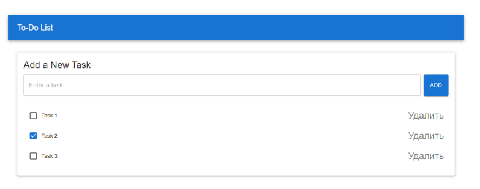

## React Практикум 16

**Задание.** Создайте приложение To-Do List, используя компоненты Material UI. Приложение должно позволять пользователям добавлять новые задачи, отмечать их выполненными и удалять задачи.

1. Создание нового проекта
- Создайте новый React-проект с помощью команды: npx create-react-app todo-app
- Перейдите в папку проекта: cd todo-app

2. Установка Material UI
- Установите необходимые пакеты Material UI: npm install @mui/material @emotion/react @emotion/styled

3. Настройка компонента App
- Откройте файл `src/App.js` и удалите его содержимое, чтобы начать с чистого листа.

4. Импорт необходимых компонентов
- Импортируйте React и хук `useState` для управления состоянием.
- Импортируйте компоненты Material UI: `AppBar`, `Toolbar`, `Typography`,
`TextField`, `Button`, `Container`, `Box`, `Paper`, `List`, `ListItem`, `ListItemText`, `Checkbox`.

5. Создание состояния
- Используйте хук `useState` для хранения текущей задачи и списка задач.

6. Разметка компонента
- AppBar: Создайте верхнюю панель с заголовком. Используйте атрибуты для настройки заголовка.
- Container: Создайте основной контейнер. Внутри используйте `Box` для отступов.
- Paper: Создайте карточку для формы и списка задач. Используйте атрибуты для настройки внешнего вида карточки.
- TextField: Создайте поле ввода для новой задачи.
    - Используйте атрибуты `variant`, `fullWidth`, `placeholder` и `value`.
    - Управляйте изменениями с помощью атрибута `onChange`.
- Button: Создайте кнопку для добавления новой задачи. Используйте атрибуты `variant`, `color`, `fullWidth` и `onClick`.
- List: Создайте список задач. Внутри используйте `ListItem` для каждого элемента списка.
- Checkbox: Добавьте флажок для отметки задачи как выполненной. Используйте атрибуты `edge`, `checked` и `onClick`.
- ListItemText: Добавьте текст задачи. Используйте атрибут `primary` и настройте стиль текста.
- Button: Добавьте кнопку удаления задачи. Используйте атрибуты variant и `onClick`.

7. Функции обработки событий
- Создайте функцию для добавления новой задачи. Проверьте, что поле ввода не пустое, добавьте задачу и очистите поле ввода.
- Создайте функцию для переключения состояния задачи. Изменяйте состояние выполнения задачи при нажатии.
- Создайте функцию для удаления задачи. Удаляйте задачу из списка при нажатии на кнопку удаления.

8. Запуск приложения
- Сохраните изменения и запустите приложение: npm start. 

Вы создадите функциональное To-Do List приложение, которое позволяет добавлять, отмечать выполненными и удалять задачи, используя компоненты Material UI. Приложение будет иметь стильный и удобный интерфейс.

