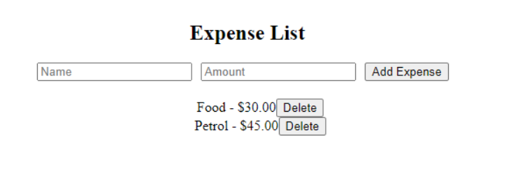

### React Практикум 20

**Задание. Создать простое приложение для учета затрат. Пользователь должен иметь возможность добавлять новые затраты, удалять их.**

1. Создайте новый React-проект.

- Используйте Create React App для создания нового React-проекта.

2. Установите необходимые библиотеки.

- Установите `redux`, `@reduxjs/toolkit` и `react-redux`.

3. Создайте хранилище (store) Redux.

- Создайте файл `store.js`.
- Настройте и экспортируйте хранилище Redux, используя `configureStore` из `@reduxjs/toolkit`.

4. Создайте срез состояния для затрат.

- Создайте файл `expenseSlice.js`.
- Определите начальное состояние, содержащее массив затрат.
- Используйте `createSlice` для создания среза состояния с именем `expenses`, определите редюсеры для добавления и удаления затрат, и экспортируйте действия и редюсер.

5. Подключите хранилище к вашему приложению.

- В корневом компоненте оберните ваше приложение в `Provider` из `react-redux` и передайте ему хранилище.

6. Создайте компонент для отображения списка затрат и формы для добавления новых затрат.

- Создайте файл `ExpenseList.js`.
- Используйте `useSelector` для извлечения списка затрат из состояния.
- Отобразите список затрат в виде таблицы или списка.
- Добавьте форму с полями ввода для названия затраты и ее суммы, а также кнопку для добавления новой затраты.
- Используйте `useDispatch` для отправки действий добавления затраты.

7. Создайте компонент для отображения отдельной затраты с возможностью удаления.

- Создайте файл `ExpenseItem.js`.
- Отобразите информацию о затрате (название и сумма) и кнопку "Удалить".
- Используйте `useDispatch` для отправки действия удаления затраты.

8. Проверка

- Запустите приложение и убедитесь, что вы можете добавлять новые затраты, заполняя поля ввода и нажимая кнопку "Добавить".
- Убедитесь, что вы можете удалять затраты, нажимая кнопку "Удалить" рядом с каждой затратой.

